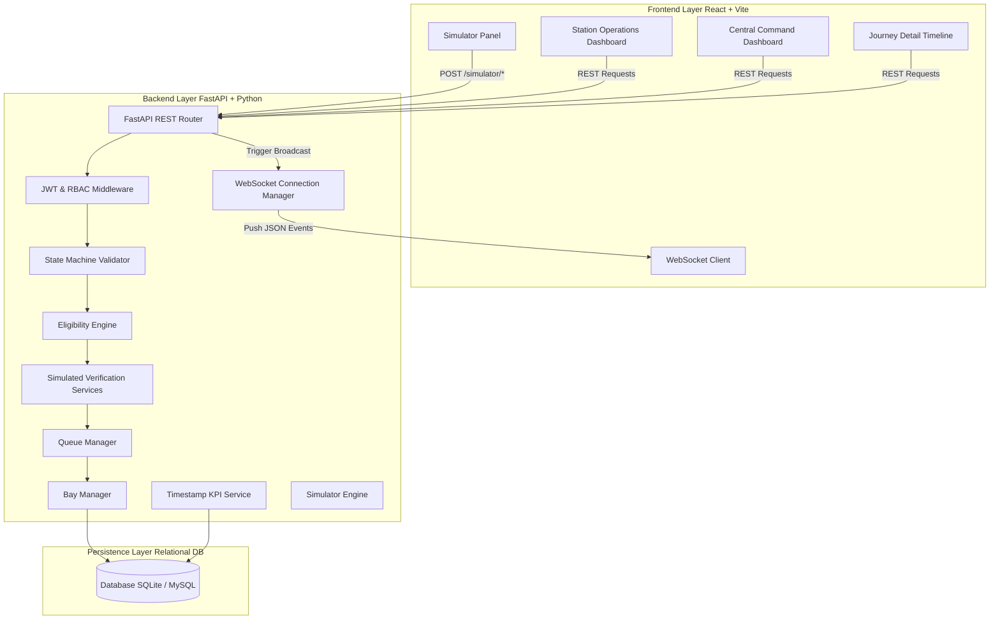

# System Architecture Diagram

```mermaid
graph TD
    subgraph Frontend Layer React + Vite
        SD[Station Operations Dashboard]
        CD[Central Command Dashboard]
        JD[Journey Detail Timeline]
        SIM_UI[Simulator Panel]
        WSC[WebSocket Client]
    end

    subgraph Backend Layer FastAPI + Python
        API[FastAPI REST Router]
        AUTH[JWT & RBAC Middleware]
        SM[State Machine Validator]
        RULE[Eligibility Engine]
        VERIF[Simulated Verification Services]
        QUEUE[Queue Manager]
        BAY[Bay Manager]
        KPI[Timestamp KPI Service]
        WS_MGR[WebSocket Connection Manager]
        SIM_ENG[Simulator Engine]
    end

    subgraph Persistence Layer Relational DB
        DB[(Database SQLite / MySQL)]
    end

    SIM_UI -->|POST /simulator/*| API
    SD -->|REST Requests| API
    CD -->|REST Requests| API
    JD -->|REST Requests| API

    API --> AUTH
    AUTH --> SM
    SM --> RULE
    RULE --> VERIF
    VERIF --> QUEUE
    QUEUE --> BAY
    BAY --> DB
    KPI --> DB

    WS_MGR -->|Push JSON Events| WSC
    API -->|Trigger Broadcast| WS_MGR
```
