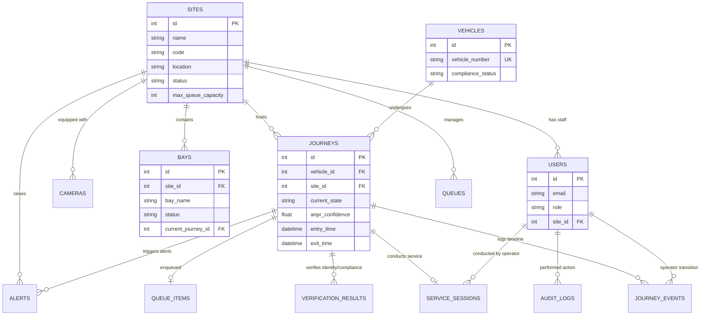

# Database ER Diagram

```mermaid
erDiagram
    SITES ||--o{ USERS : "has staff"
    SITES ||--o{ CAMERAS : "equipped with"
    SITES ||--o{ BAYS : "contains"
    SITES ||--o{ JOURNEYS : "hosts"
    SITES ||--o{ QUEUES : "manages"
    SITES ||--o{ ALERTS : "raises"

    VEHICLES ||--o{ JOURNEYS : "undergoes"
    JOURNEYS ||--o{ JOURNEY_EVENTS : "logs timeline"
    JOURNEYS ||--o{ VERIFICATION_RESULTS : "verifies identity/compliance"
    JOURNEYS ||--o| QUEUE_ITEMS : "enqueued"
    JOURNEYS ||--o| SERVICE_SESSIONS : "conducts service"
    JOURNEYS ||--o{ ALERTS : "triggers alerts"

    USERS ||--o{ JOURNEY_EVENTS : "operator transition"
    USERS ||--o{ SERVICE_SESSIONS : "conducted by operator"
    USERS ||--o{ AUDIT_LOGS : "performed action"

    SITES {
        int id PK
        string name
        string code
        string location
        string status
        int max_queue_capacity
    }

    USERS {
        int id PK
        string email
        string role
        int site_id FK
    }

    VEHICLES {
        int id PK
        string vehicle_number UK
        string compliance_status
    }

    JOURNEYS {
        int id PK
        int vehicle_id FK
        int site_id FK
        string current_state
        float anpr_confidence
        datetime entry_time
        datetime exit_time
    }

    BAYS {
        int id PK
        int site_id FK
        string bay_name
        string status
        int current_journey_id FK
    }
```
